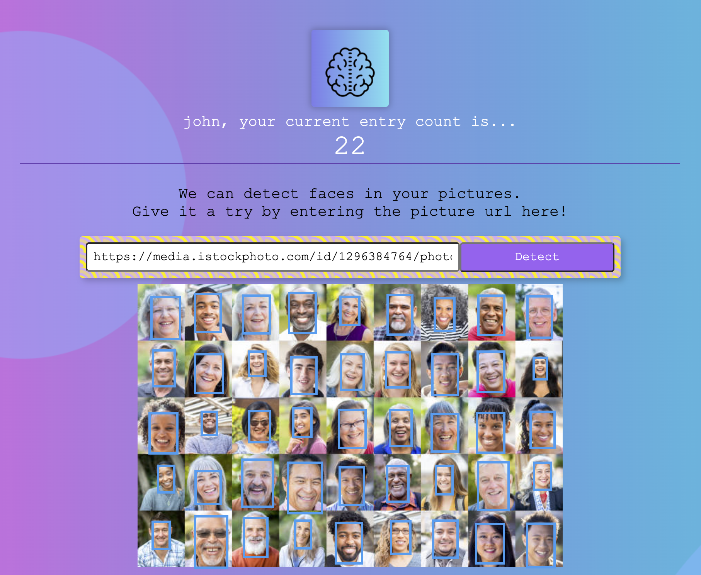

# Face Identifier Website

  

Welcome to the Face Identifier website ([click here to try it](https://face-identifier.onrender.com/))! This web application allows users to sign in, register, and detect faces in pictures. It also keeps track of the number of entries of picture URLs for each user.

## Screenshots

  

_Sign in page_

_John's account page, they have entered 22 picture urls_

## Features

-   Sign In: Users can sign in to their accounts using their credentials.
-   Register: New users can register an account by providing their information.
-   Face Detection: The website uses advanced facial recognition algorithms to detect faces in uploaded pictures.
-   Picture Entry Count: The application keeps track of the number of entries of picture URLs for each user, allowing them to monitor their activity.

## Tools Used

The Face Identifier website is built using the following technologies and tools:

-   **Javascript**
-   **React.js**
-   **Postgres Database**
-   **Node.js**
-   **Express.js**

## Getting Started

To run the Face Identifier website locally, please follow these steps:

1. Clone the repository: `git clone https://github.com/your-username/face-identifier.git`.
2. Install the required dependencies: `npm install`.
3. Set up the PostgreSQL database and configure the connection in the application.
4. Start the server: `npm start`.
5. Open the web application in your browser: `http://localhost:3000`.

Please note that these are general instructions, and you might need to adjust them based on your specific setup and requirements.

## License

This project is licensed under the [MIT License](LICENSE).
